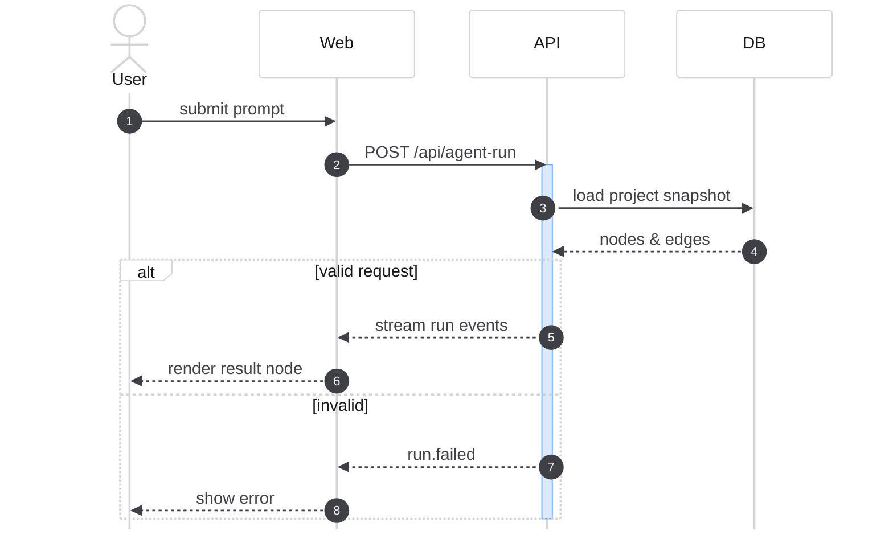

# Sequence Diagram (Mermaid)

Turn a natural-language flow description into a clean, correct Mermaid `sequenceDiagram`. Use this for design docs, technical proposals, and general flow illustration.

## When to Use

- User asks to draw / create / generate a 时序图 or sequence diagram.
- User describes an interaction flow (who calls whom, in what order) and wants it visualized.
- A design or proposal document needs an interaction timeline between actors/services.

## Workflow

1. **Identify participants.** Extract the distinct actors/services/components. Order them left-to-right by first appearance in the flow.
2. **Order the messages.** List each interaction in chronological order. Decide for each whether it is:
   - synchronous call: `->>`
   - response / return: `-->>`
   - async / fire-and-forget: `-)`
3. **Group and annotate** where it clarifies intent:
   - `alt` / `else` for conditional branches
   - `opt` for optional steps
   - `loop` for repetition
   - `par` / `and` for parallel work
   - `Note over A,B: ...` for context
   - `activate` / `deactivate` (or `+`/`-` shorthand) for lifelines when nesting matters
4. **Emit a single fenced ` ```mermaid ` block.** Verify syntax before returning.

## Conventions

- Declare participants explicitly with `participant`/`actor` so display names and order are stable.
- Use `autonumber` when the user wants numbered steps.
- Keep message labels short and verb-first (e.g. `POST /agent-run`, `validate token`, `return artifacts`).
- One arrow per logical interaction; do not collapse a call and its response into one line.
- Prefer `actor` for humans/external clients, `participant` for systems.

## Visual Style

Apply a consistent, clean look. Put an `init` directive on the first line and a `%%{...}%%` config block before `sequenceDiagram`.

- **Theme**: use `base` theme with explicit `themeVariables` so colors are stable across renderers (avoid the default purple).
- **Palette**: neutral backgrounds with one accent. Recommended:
  - `primaryColor: '#f4f4f5'` (participant box fill)
  - `primaryBorderColor: '#d4d4d8'`
  - `primaryTextColor: '#18181b'`
  - `actorBkg: '#ffffff'`, `actorBorder: '#d4d4d8'`
  - `signalColor: '#3f3f46'`, `signalTextColor: '#3f3f46'`
  - `noteBkgColor: '#fef9c3'`, `noteBorderColor: '#fde047'`
  - accent for highlights: `activationBkgColor: '#dbeafe'`, `activationBorderColor: '#60a5fa'`
- **Layout config** (set in the config block, not themeVariables):
  - `mirrorActors: false` — keep actor labels at the top only.
  - `wrap: true` — wrap long messages instead of overflowing.
  - `boxMargin: 8`, `messageMargin: 28` for breathing room.
- **Notes**: use `rect` blocks sparingly to shade a phase; pick a low-saturation fill (e.g. `rgb(244,244,245)`).
- Match the project's flat, light-gray aesthetic (`#d4d4d8` borders, `rounded` boxes) rather than heavy/saturated defaults.

### Style preamble template

```mermaid
%%{init: {'theme':'base','themeVariables':{'primaryColor':'#f4f4f5','primaryBorderColor':'#d4d4d8','primaryTextColor':'#18181b','actorBkg':'#ffffff','actorBorder':'#d4d4d8','signalColor':'#3f3f46','signalTextColor':'#3f3f46','noteBkgColor':'#fef9c3','noteBorderColor':'#fde047','activationBkgColor':'#dbeafe','activationBorderColor':'#60a5fa'}, 'sequence':{'mirrorActors':false,'wrap':true,'boxMargin':8,'messageMargin':28}}}%%
sequenceDiagram
    autonumber
    ...
```

## Template



## Output Rules

- Return the diagram inside a ` ```mermaid ` code block so it renders directly in Markdown.
- If the input flow is ambiguous (missing actor, unclear order), ask one focused clarifying question before drawing.
- After the diagram, optionally add a 1-2 line note on assumptions made — only if you inferred something not stated.
