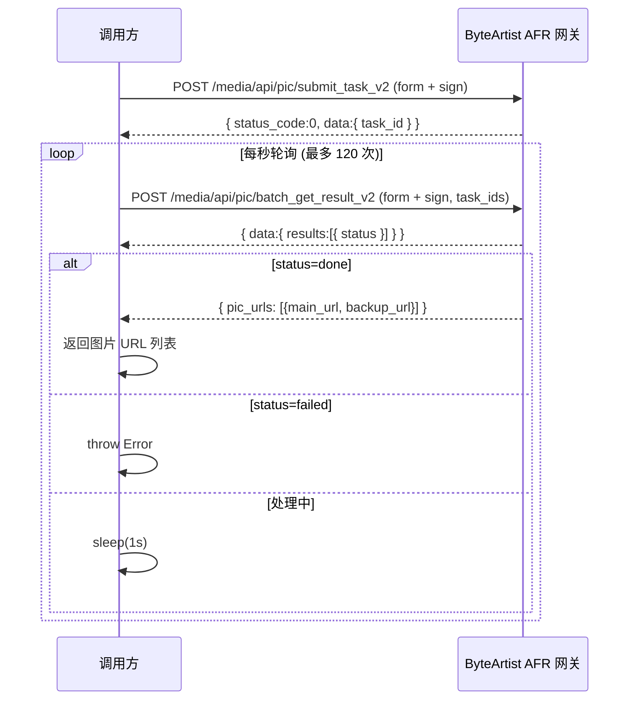

好的，以下是一份完整的 ByteArtist（Seed4/字节 AFR）集成文档，包含可直接复用的 TypeScript 代码。

---

# ByteArtist (Seed4) 图像生成 API 集成文档

## 1. 概述

ByteArtist 是字节跳动内部的 AI 图像生成服务（又称 Seed4 / AFR），采用**异步任务提交 + 轮询获取结果**的模式：

1. 调用 `submit_task_v2` 提交生成任务，获得 `task_id`
2. 轮询 `batch_get_result_v2` 查询任务状态，直到任务完成或失败
3. 任务完成后从响应中提取图片 URL 或 base64 数据

**当前使用模型**: `seed4_0407_lemo`（Prompt 字段名特殊，见下文）

---

## 2. 环境变量配置

| 变量名 | 说明 | 示例值 |
|--------|------|--------|
| `GATEWAY_BASE_URL` | AFR 网关地址 | `https://lv-api-lf.ulikecam.com` |
| `BYTEDANCE_AID` | 应用 ID | `6834` |
| `BYTEDANCE_APP_KEY` | App Key | 从字节 AFR 平台获取 |
| `BYTEDANCE_APP_SECRET` | App Secret（用于签名） | 从字节 AFR 平台获取 |

---

## 3. 签名算法

每次 API 请求都需要携带签名参数。签名规则：

```
sign = SHA1(sort([nonce, timestamp, APP_SECRET]).join(''))
```

- `nonce`: 随机正整数（建议 `Math.floor(Math.random() * 2147483647)`）
- `timestamp`: 秒级 Unix 时间戳（`Math.floor(Date.now() / 1000)`）
- 三个字符串按字典序排序后拼接，再做 SHA1 哈希

---

## 4. 完整 TypeScript 集成代码

### 4.1 类型定义与工具函数

```typescript
import crypto from 'crypto';

// ============ 配置 ============
interface AFRConfig {
  baseUrl: string;
  aid: string;
  appKey: string;
  appSecret: string;
}

function resolveConfig(): AFRConfig {
  const baseUrl = process.env.GATEWAY_BASE_URL?.trim();
  const aid = process.env.BYTEDANCE_AID?.trim();
  const appKey = process.env.BYTEDANCE_APP_KEY?.trim();
  const appSecret = process.env.BYTEDANCE_APP_SECRET?.trim();

  if (!baseUrl || !aid || !appKey || !appSecret) {
    const missing = [
      !baseUrl && 'GATEWAY_BASE_URL',
      !aid && 'BYTEDANCE_AID',
      !appKey && 'BYTEDANCE_APP_KEY',
      !appSecret && 'BYTEDANCE_APP_SECRET',
    ].filter(Boolean);
    throw new Error(`Missing ByteDance AFR environment variables: ${missing.join(', ')}`);
  }

  return { baseUrl, aid, appKey, appSecret };
}

// ============ 签名工具 ============
function sha1(message: string): string {
  return crypto.createHash('sha1').update(message).digest('hex');
}

function generateNonce(): string {
  return Math.floor(Math.random() * 2147483647).toString();
}

function generateTimestamp(): string {
  return Math.floor(Date.now() / 1000).toString();
}

function generateSign(nonce: string, timestamp: string, secretKey: string): string {
  const stringList = [nonce, timestamp, secretKey];
  stringList.sort();
  return sha1(stringList.join(''));
}

// ============ 公共签名参数构建 ============
function buildSignedFormParams(config: AFRConfig, reqKey: string): URLSearchParams {
  const nonce = generateNonce();
  const timestamp = generateTimestamp();
  const sign = generateSign(nonce, timestamp, config.appSecret);

  const formData = new URLSearchParams();
  formData.append('aid', config.aid);
  formData.append('app_key', config.appKey);
  formData.append('nonce', nonce);
  formData.append('timestamp', timestamp);
  formData.append('sign', sign);
  formData.append('req_key', reqKey);
  formData.append('img_return_type', 'url');
  formData.append('img_return_format', 'png');
  return formData;
}
```

### 4.2 提交任务接口

```typescript
interface SubmitTaskOptions {
  modelId: string;       // 如 'seed4_0407_lemo'
  prompt: string;
  width: number;
  height: number;
  image?: string;        // 参考图：URL / data:image/...;base64,xxx / 纯base64
}

interface SubmitTaskResponse {
  status_code: number;
  message?: string;
  data?: { task_id?: string };
}

async function submitTask(options: SubmitTaskOptions): Promise<string> {
  const { modelId, prompt, width, height, image } = options;
  const config = resolveConfig();
  const url = `${config.baseUrl}/media/api/pic/submit_task_v2`;

  // 构建 req_json
  const reqJson: Record<string, unknown> = {
    width,
    height,
    seed: -1,
  };

  // ⚠️ 注意：seed4_0407_lemo 模型使用大写 Prompt 字段，其他模型用 string 字段
  if (modelId === 'seed4_0407_lemo') {
    reqJson.Prompt = prompt;
  } else {
    reqJson.string = prompt;
  }

  const formData = buildSignedFormParams(config, modelId);
  formData.append('req_json', JSON.stringify(reqJson));
  formData.append('expired_duration', '600');

  // 处理参考图
  if (image) {
    if (image.startsWith('http')) {
      formData.append('image_url', image);
    } else if (image.startsWith('data:')) {
      const base64Data = image.split(',')[1] ?? image;
      formData.append('image_data', base64Data);
    } else {
      formData.append('image_data', image);
    }
  }

  const response = await fetch(url, {
    method: 'POST',
    headers: { 'Content-Type': 'application/x-www-form-urlencoded' },
    body: formData.toString(),
  });

  const data = await response.json() as SubmitTaskResponse;

  if (!response.ok || data.status_code !== 0) {
    throw new Error(`Submit task failed [${data.status_code}]: ${data.message || response.status}`);
  }

  const taskId = data.data?.task_id;
  if (!taskId) {
    throw new Error('No task_id returned from submit_task_v2');
  }

  return taskId;
}
```

### 4.3 轮询获取结果接口

```typescript
type TaskStatus = number | string;

interface PollResultOptions {
  modelId: string;
  taskId: string;
  maxAttempts?: number;   // 默认 120（约 120 秒超时）
  pollIntervalMs?: number; // 默认 1000ms
}

interface PollResultItem {
  status?: TaskStatus;
  pic_urls?: Array<{ main_url?: string; backup_url?: string }>;
  binary_data?: string[];
  message?: string;
}

interface PollResultResponse {
  status_code: number;
  message?: string;
  data?: { results?: PollResultItem[] };
}

function isDoneStatus(status: TaskStatus | undefined): boolean {
  return status === 'done' || status === 1 || status === 'DONE';
}

function isFailedStatus(status: TaskStatus | undefined): boolean {
  return status === 'failed' || status === 2 || status === 'FAILED';
}

async function pollForResult(options: PollResultOptions): Promise<string[]> {
  const { modelId, taskId, maxAttempts = 120, pollIntervalMs = 1000 } = options;
  const config = resolveConfig();
  const url = `${config.baseUrl}/media/api/pic/batch_get_result_v2`;

  for (let attempt = 1; attempt <= maxAttempts; attempt++) {
    const formData = buildSignedFormParams(config, modelId);
    formData.append('task_ids', taskId);

    const response = await fetch(url, {
      method: 'POST',
      headers: { 'Content-Type': 'application/x-www-form-urlencoded' },
      body: formData.toString(),
    });

    const data = await response.json() as PollResultResponse;

    if (!response.ok || data.status_code !== 0) {
      throw new Error(`Poll result failed [${data.status_code}]: ${data.message || response.status}`);
    }

    const result = data.data?.results?.[0];
    if (!result) {
      await new Promise((r) => setTimeout(r, pollIntervalMs));
      continue;
    }

    const { status } = result;

    // 任务完成
    if (isDoneStatus(status)) {
      // 优先取 pic_urls
      const picUrls = result.pic_urls;
      if (picUrls && picUrls.length > 0) {
        const images = picUrls
          .map((p) => p.main_url || p.backup_url)
          .filter((url): url is string => Boolean(url));
        if (images.length > 0) return images;
      }
      // 其次取 binary_data (base64)
      if (result.binary_data && result.binary_data.length > 0) {
        return result.binary_data.map((b64) => `data:image/png;base64,${b64}`);
      }
      throw new Error(`Task completed but no image data: ${result.message || 'No pic_urls or binary_data'}`);
    }

    // 任务失败
    if (isFailedStatus(status)) {
      throw new Error(`Task failed: ${result.message || 'Unknown error'}`);
    }

    // 处理中，等待后继续
    if (attempt < maxAttempts) {
      await new Promise((r) => setTimeout(r, pollIntervalMs));
    }
  }

  throw new Error(`Poll timeout: task ${taskId} did not complete within ${maxAttempts * pollIntervalMs / 1000} seconds`);
}
```

### 4.4 统一调用入口

```typescript
interface GenerateImageOptions {
  modelId?: string;       // 默认 'seed4_0407_lemo'
  prompt: string;
  width?: number;         // 默认 1024
  height?: number;        // 默认 1024
  imageSize?: '1K' | '2K' | '4K';  // 尺寸预设，优先级低于 width/height
  image?: string;         // 参考图（i2i）
}

interface GenerateImageResult {
  images: string[];       // 图片 URL 或 data URL 列表
  taskId: string;
  width: number;
  height: number;
}

const SIZE_MAP: Record<string, number> = { '1K': 1024, '2K': 2048, '4K': 4096 };

async function generateImage(options: GenerateImageOptions): Promise<GenerateImageResult> {
  const modelId = options.modelId || 'seed4_0407_lemo';
  const sizePx = options.imageSize ? SIZE_MAP[options.imageSize] : undefined;
  const width = options.width || sizePx || 1024;
  const height = options.height || sizePx || 1024;

  // 1. 提交任务
  const taskId = await submitTask({
    modelId,
    prompt: options.prompt,
    width,
    height,
    image: options.image,
  });

  // 2. 轮询结果
  const images = await pollForResult({ modelId, taskId });

  return { images, taskId, width, height };
}
```

---

## 5. 使用示例

```typescript
// 文生图 (text-to-image)
const result = await generateImage({
  prompt: '小龙虾形状的lemo，米黄色纯色背景',
  imageSize: '2K',
});
console.log('Generated images:', result.images);
console.log('Task ID:', result.taskId);

// 图生图 (image-to-image)
const result2 = await generateImage({
  prompt: '保持构图，换成赛博朋克风格',
  width: 2048,
  height: 2048,
  image: 'https://example.com/reference.jpg',  // 支持 URL、data URL 或纯 base64
});
```

---

## 6. 关键注意事项

| 事项 | 说明 |
|------|------|
| **Prompt 字段名** | `seed4_0407_lemo` 使用大写 `Prompt`，其他模型使用小写 `string` |
| **签名每次重新生成** | 提交和每次轮询都必须生成新的 `nonce`/`timestamp`/`sign` |
| **Content-Type** | 必须是 `application/x-www-form-urlencoded`，**不是 JSON** |
| **参考图格式** | URL 传 `image_url`；base64/data URL 传 `image_data`（去掉 data: 前缀） |
| **尺寸约束** | `seed4_0407_lemo` 最小 1024×1024，推荐 2048×2048 (2K) |
| **轮询间隔** | 建议 1 秒，不要过于频繁；超时时间建议 120 秒以上 |
| **返回格式** | 设置了 `img_return_type=url`，优先返回 CDN URL；`binary_data` 为 base64 兜底 |
| **seed 参数** | 当前固定为 `-1`（随机），如需要固定种子可修改 `reqJson.seed` |
| **不支持的参数** | negativePrompt（反向提示词）、batchSize（批量）、aspectRatio 均不在当前 req_json 中传递 |
| **代理** | 内网环境可能需要配置 `HTTPS_PROXY`/`HTTP_PROXY`，通过 `HttpsProxyAgent`（Node.js）或系统代理传递给 fetch |

---

## 7. Node.js 环境补充（代理支持）

如果在 Node.js 环境需要走代理，安装 `https-proxy-agent` 并改造 fetch 调用：

```bash
pnpm add https-proxy-agent
```

```typescript
import { HttpsProxyAgent } from 'https-proxy-agent';

function getProxyAgent() {
  const proxyUrl = process.env.HTTPS_PROXY || process.env.HTTP_PROXY;
  return proxyUrl ? new HttpsProxyAgent(proxyUrl) : undefined;
}

// fetch 时传入 agent
const response = await fetch(url, {
  method: 'POST',
  headers: { 'Content-Type': 'application/x-www-form-urlencoded' },
  body: formData.toString(),
  agent: getProxyAgent(),  // Node.js 特有
} as RequestInit & { agent?: unknown });
```

---

## 8. API 时序图



---

以上代码可以直接复制到任何 Node.js/TypeScript 项目中使用，零依赖（仅需 Node.js 内置 `crypto` 模块；代理场景额外安装 `https-proxy-agent`）。